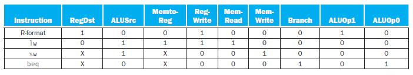
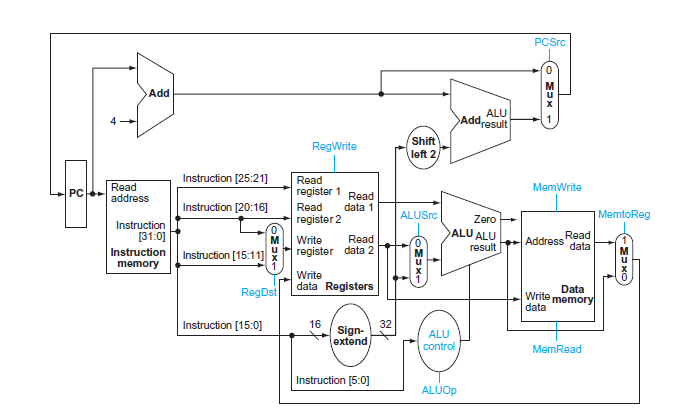
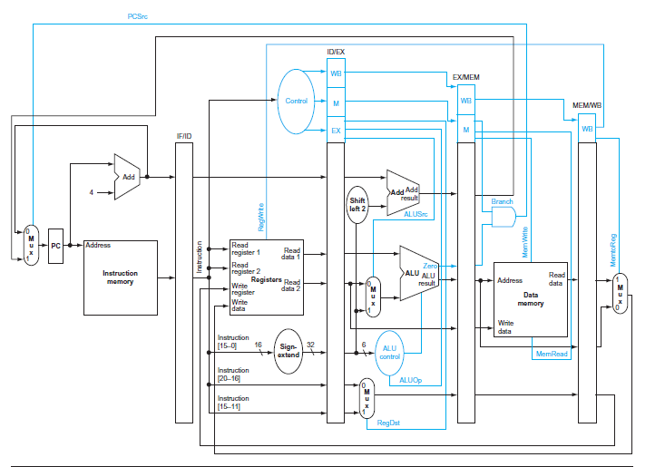
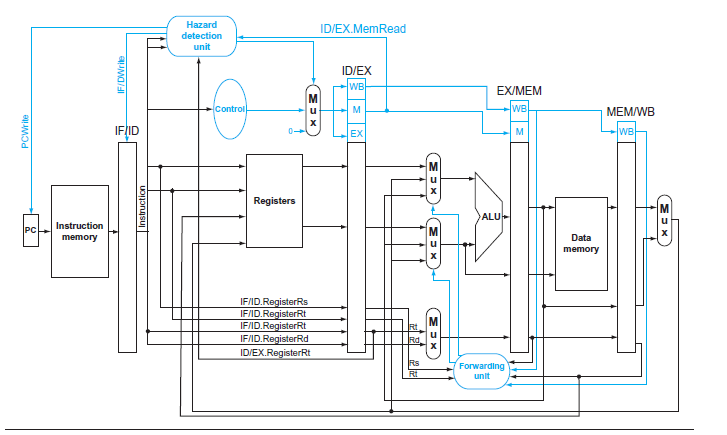

# The Datapath MIPS architecture

### Control Setting

## simple
### code : Pipeline_Simple.c

-----------------------------

## Pipeline
### code : Pipeline_DataHazard(x).c

-----------------------------

## Pipeline_DataHazard
### code : Pipeline_DataHazard.c

